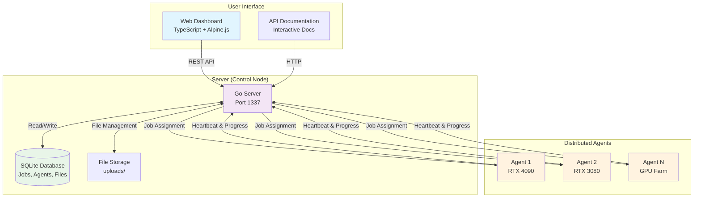
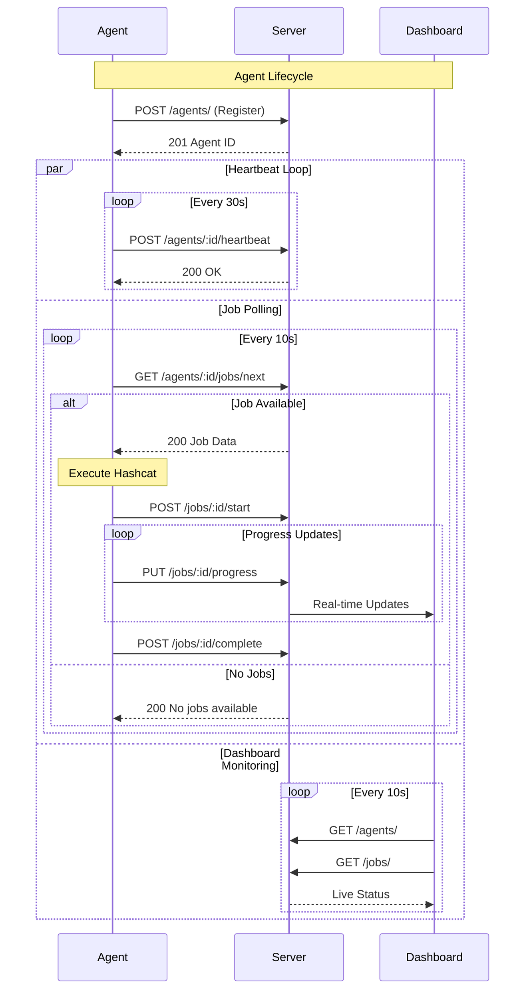
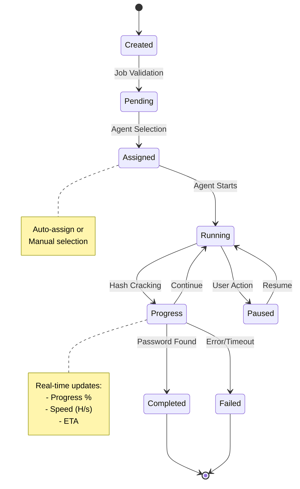
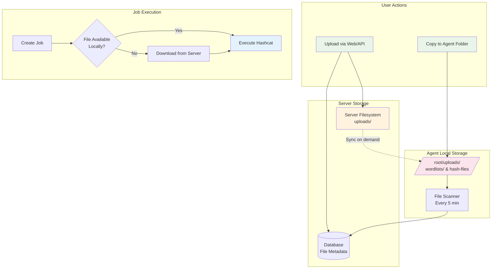

# Distributed Hashcat System

A modern distributed hashcat cracking system built with Go 1.24, featuring clean architecture and a **production-ready web dashboard**.

## ✨ Features

- **Modern Go 1.24**: Takes advantage of latest Go performance improvements and features
- **Distributed Architecture**: Scale across multiple GPU machines in cloud infrastructure
- **Production-Ready Frontend**: Modern TypeScript dashboard with Alpine.js and Tailwind CSS
- **Real-time Dashboard**: Live monitoring with auto-refresh and responsive design
- **Hybrid File Management**: Upload via API or copy directly to agent folders
- **Local Agent Storage**: Pre-sync wordlists and hash files in `/root/uploads/`
- **Clean Architecture**: Domain-driven design with proper separation of concerns
- **Multiple Hash Formats**: Support for hccapx, hccap, cap, pcap, and hash files
- **RESTful API**: Complete v1 API for programmatic control
- **Docker Support**: Easy deployment with Docker containers
- **SQLite Database**: Lightweight, embedded database optimized for performance

## 🏗️ System Architecture

### **High-Level Overview**



### **Agent-Server Communication Flow**



### **Job Lifecycle Management**



### **Frontend-Backend Data Flow**

```mermaid
graph LR
    subgraph "Frontend (TypeScript)"
        UI[User Interface]
        STORES[Data Stores<br/>Agent/Job/File]
        API_SVC[API Service<br/>HTTP Client]
    end
    
    subgraph "Backend (Go)"
        HANDLERS[HTTP Handlers<br/>REST Endpoints]
        USECASES[Business Logic<br/>Use Cases]
        REPOS[Data Layer<br/>Repositories]
        DB[(SQLite<br/>Database)]
    end
    
    UI -->|User Actions| STORES
    STORES -->|API Calls| API_SVC
    API_SVC -->|HTTP Requests| HANDLERS
    HANDLERS -->|Business Logic| USECASES
    USECASES -->|Data Access| REPOS
    REPOS <-->|SQL| DB
    
    HANDLERS -->>|JSON Response| API_SVC
    API_SVC -->>|Data| STORES
    STORES -->>|State Updates| UI
    
    style UI fill:#e3f2fd
    style STORES fill:#f1f8e9
    style API_SVC fill:#fff3e0
    style HANDLERS fill:#fce4ec
    style USECASES fill:#f3e5f5
    style REPOS fill:#e8f5e8
    style DB fill:#e0f2f1
```

### **File Management Workflow**



## 🚀 Quick Start

### **Frontend + Backend Setup**

```bash
# 1. Start the backend API server
make init && make build
./bin/server  # Runs on http://localhost:1337

# 2. In another terminal, start the frontend
cd frontend
npm install
npm run dev   # Runs on http://localhost:3000

# 3. Access the dashboard
open http://localhost:3000
```

### **Using Make (Recommended)**

```bash
# Initialize project
make init

# Install dependencies  
make deps

# Build binaries
make build

# Run server
make run-server

# In another terminal, run agent
make run-agent
```

### **Manual Setup**

```bash
# Download dependencies
go mod download

# Build server
go build -o bin/server cmd/server/main.go

# Build agent  
go build -o bin/agent cmd/agent/main.go

# Create directories
mkdir -p data uploads

# Run server
./bin/server

# Run agent (in another terminal)
./bin/agent --server http://localhost:1337
```

## 🌐 Modern Web Dashboard

### **Access Points**
- **Frontend**: http://localhost:3000 (Development)
- **API**: http://localhost:1337 (Backend)
- **API Documentation**: http://localhost:1337/docs (Complete API docs with examples)
- **Production**: Optimized build in `frontend/dist/`

### **Dashboard Features**
- 📊 **Overview Tab**: System statistics, agent status, recent activity
- 🖥️ **Agents Tab**: Register, monitor, and manage GPU agents
- ⚙️ **Jobs Tab**: Create, start, pause, and monitor cracking jobs
- 📁 **Hash Files Tab**: Upload, download, and manage hash files  
- 📋 **Wordlists Tab**: Upload, download, and manage wordlist collections

### **UI/UX Highlights**
- **Mobile-First**: Responsive design for phones, tablets, and desktops
- **Real-Time**: Auto-refresh every 10 seconds with live progress
- **TypeScript**: Full type safety and modern development experience
- **Performance**: 47KB JS, 16KB CSS optimized bundles
- **Accessibility**: Keyboard navigation and screen reader support

### **Technology Stack**
- **Build Tool**: Vite (lightning fast)
- **Language**: TypeScript (type safety)
- **Framework**: Alpine.js (lightweight reactivity)
- **Styling**: Tailwind CSS (utility-first)
- **Icons**: Font Awesome (comprehensive)

## 📂 Agent File Management

### **Local File Structure**
Each agent automatically creates and manages local files in `/root/uploads/`:

```bash
📂 /root/uploads/
├── 📁 wordlists/              # Place your wordlists here
│   ├── rockyou.txt            # Classic wordlist
│   ├── common-passwords.txt   # Common passwords
│   ├── leaked-passwords.txt   # From data breaches  
│   └── custom-domain.txt      # Custom/target-specific
├── 📁 hash-files/             # Place your hash files here
│   ├── capture1.hccapx        # WiFi handshakes
│   ├── wifi-crack.hccap       # Legacy format
│   └── network-capture.cap    # Raw captures
└── 📁 temp/                   # Temporary downloads
    └── processing/
```

### **Hybrid File Access**
Agents support multiple ways to provide files:

#### **Option 1: Manual Copy** (Recommended for large files)
```bash
# On each agent machine
sudo cp /path/to/rockyou.txt /root/uploads/wordlists/
sudo cp /path/to/handshake.hccapx /root/uploads/hash-files/

# Agent auto-detects new files every 5 minutes
```

#### **Option 2: Web Dashboard Upload**
- Upload via modern web interface at `http://localhost:3000`
- Files are synced to all online agents
- Perfect for smaller files and one-time uploads

#### **Option 3: API Upload**
```bash
# Upload wordlist
curl -X POST -F "file=@rockyou.txt" \
  http://localhost:1337/api/v1/wordlists/upload

# Upload hash file  
curl -X POST -F "file=@capture.hccapx" \
  http://localhost:1337/api/v1/hashfiles/upload
```

### **Agent Behavior**
- **Startup**: Scans `/root/uploads/` and registers available files with server
- **Runtime**: Monitors folder for changes every 5 minutes
- **Job Execution**: Uses local files first, downloads if not available
- **Auto-cleanup**: Removes downloaded temporary files after job completion

## 🔌 API Usage

### **Complete API Documentation**
📚 **Access the interactive API documentation at:** http://localhost:1337/docs

The comprehensive docs include:
- All available endpoints with examples
- Request/response schemas
- cURL examples for every endpoint  
- Python integration examples
- Complete workflows (WiFi cracking, etc.)

### **Endpoints (v1 API)**

All API endpoints use the `/api/v1/` prefix for versioning:

#### **Hash Files**
```bash
# Upload hash file
curl -X POST -F "file=@capture.hccapx" \
  http://localhost:1337/api/v1/hashfiles/upload

# List hash files
curl http://localhost:1337/api/v1/hashfiles/

# Download hash file
curl http://localhost:1337/api/v1/hashfiles/{id}/download
```

#### **Wordlists**
```bash
# Upload wordlist
curl -X POST -F "file=@rockyou.txt" \
  http://localhost:1337/api/v1/wordlists/upload

# List wordlists
curl http://localhost:1337/api/v1/wordlists/

# Download wordlist
curl http://localhost:1337/api/v1/wordlists/{id}/download
```

#### **Jobs**
```bash
# Create cracking job
curl -X POST -H "Content-Type: application/json" \
  -d '{
    "name": "WiFi Crack Job",
    "hash_type": 2500,
    "attack_mode": 0,
    "hash_file_id": "uuid-here",
    "wordlist_id": "wordlist-uuid-here"
  }' \
  http://localhost:1337/api/v1/jobs/

# Start job
curl -X POST http://localhost:1337/api/v1/jobs/{id}/start

# Get job status
curl http://localhost:1337/api/v1/jobs/{id}
```

#### **Agents**
```bash
# Register agent
curl -X POST -H "Content-Type: application/json" \
  -d '{
    "name": "GPU-Server-01",
    "ip_address": "192.168.1.100",
    "port": 8081,
    "capabilities": "RTX 4090, OpenCL"
  }' \
  http://localhost:1337/api/v1/agents/

# List agents
curl http://localhost:1337/api/v1/agents/

# Agent heartbeat
curl -X POST http://localhost:1337/api/v1/agents/{id}/heartbeat
```

## 🏗️ Architecture

```
┌─────────────────┐    ┌─────────────────┐    ┌─────────────────┐
│   Frontend      │    │   REST API      │    │   Agent Network │
│   (TypeScript)  │◄──►│   (Go + Gin)    │◄──►│   (GPU Machines)│
│   localhost:3000│    │   localhost:1337│    │   (Port 8080+)  │
└─────────────────┘    └─────────────────┘    └─────────────────┘
          │                       │                       │
          ▼                       ▼                       ▼
┌─────────────────┐    ┌─────────────────┐    ┌─────────────────┐
│   Vite Proxy    │    │   SQLite DB     │    │ /root/uploads/  │
│   (Development) │    │   (Jobs/Agents) │    │ (Local Files)   │
└─────────────────┘    └─────────────────┘    └─────────────────┘
```

### **Clean Architecture Layers**

- **Frontend** (`frontend/`): TypeScript + Alpine.js + Tailwind CSS
- **Domain**: Core business logic (`internal/domain/`)
- **Use Cases**: Application logic (`internal/usecase/`)
- **Infrastructure**: Database, external services (`internal/infrastructure/`)
- **Delivery**: HTTP handlers, CLI (`internal/delivery/`)

## 🧪 Testing Infrastructure

This project includes a **comprehensive testing infrastructure** with unified test runner and optimized benchmarks.

### **Test Categories**

```
📂 tests/
├── 🔧 unit/                    # Unit tests with mocks
│   ├── handler/               # HTTP handler tests
│   ├── usecase/               # Business logic tests  
│   └── repository/            # Database tests
├── 🔗 integration/            # Full API workflow tests
└── 🚀 benchmarks/             # Performance testing
```

### **Quick Testing**

```bash
# Run all tests (unit + integration + benchmarks)
./scripts/run_tests.sh --all

# Quick performance check (~10 seconds)
./scripts/run_tests.sh --benchmark-quick

# Full test suite with coverage (~60 seconds)
./scripts/run_tests.sh --all --coverage
```

### **Test Modes**

#### **🏃‍♂️ Unit Tests**
```bash
# Test individual components
./scripts/run_tests.sh --unit                    # All unit tests
./scripts/run_tests.sh --unit --verbose          # With detailed output
```

#### **🔗 Integration Tests**
```bash
# Test complete API workflows
./scripts/run_tests.sh --integration             # Full API integration
```

#### **🚀 Benchmark Tests**
```bash
# Performance testing options
./scripts/run_tests.sh --benchmark-simple        # Fastest (~2s)
./scripts/run_tests.sh --benchmark-quick         # Quick tests (~10s)  
./scripts/run_tests.sh --benchmark-individual    # All benchmarks (~30s)
./scripts/run_tests.sh --benchmark-all           # Comprehensive (~45s)
./scripts/run_tests.sh --benchmark-custom 15s    # Custom duration
```

### **Advanced Testing**

```bash
# Combined testing workflows
./scripts/run_tests.sh --all --benchmark-quick   # All tests + quick benchmarks
./scripts/run_tests.sh --unit --benchmark        # Unit tests + simple benchmark
./scripts/run_tests.sh --all --coverage --benchmark-individual  # Everything with coverage

# Performance optimization
./scripts/run_tests.sh --benchmark-quick --no-build  # Skip build for faster iteration
./scripts/run_tests.sh --verbose                     # Detailed test output
```

### **Test Results & Performance**

#### **Latest Test Status** ✅
- **Unit Tests**: 100% pass rate (handlers, usecases, repositories)
- **Integration Tests**: Full API workflow testing with real database
- **Benchmarks**: Optimized performance with no hanging issues

#### **Performance Metrics** (Apple M3)
```
BenchmarkAgentCreation-8                    72,000   18.59µs   11KB/op   84 allocs/op
BenchmarkJobCreation-8                      37,804   30.76µs   13KB/op   99 allocs/op  
BenchmarkDirectAgentCreation-8             111,704   13.76µs    2KB/op   40 allocs/op
BenchmarkAgentListing-8                     16,782   71.04µs   44KB/op  278 allocs/op
BenchmarkConcurrentAgentCreation-8         367,640    4.19µs   10KB/op   75 allocs/op
```

#### **Test Infrastructure Features**
- **Mock Framework**: Clean dependency injection with testify/mock
- **Database Isolation**: Each test gets fresh in-memory database
- **Timeout Protection**: All benchmarks have configurable timeouts  
- **Coverage Reports**: HTML reports with detailed metrics
- **CI/CD Ready**: Proper exit codes and artifacts for automation

### **Test Architecture Improvements**

#### **Performance Optimizations**
- **Database**: In-memory SQLite (`:memory:`) - 5x faster than file-based
- **Setup Time**: Reduced from ~15s to ~2s with optimized test data
- **Benchmark Stability**: No hanging issues with proper timeout handling
- **Resource Management**: Automatic cleanup and memory management

#### **Development Workflow**
```bash
# Daily development
./scripts/run_tests.sh --unit --benchmark-simple

# Pre-commit validation  
./scripts/run_tests.sh --all --benchmark-quick

# Performance regression testing
./scripts/run_tests.sh --benchmark-individual

# Full validation before release
./scripts/run_tests.sh --all --coverage --benchmark-all
```

### **Coverage & Quality Metrics**

```bash
# Generate coverage report
./scripts/run_tests.sh --all --coverage

# View HTML coverage report
open test-results/coverage.html

# Check coverage summary
go tool cover -func=coverage.out | tail -1
```

**Target Coverage**: >80% code coverage across all components

### **Testing Best Practices**

#### **For Contributors**
1. **Write unit tests** for all new features
2. **Ensure integration tests pass** for API changes
3. **Run benchmarks** to check performance impact
4. **Maintain coverage** above 80%

#### **CI/CD Integration**
```yaml
# Example GitHub Actions workflow
- name: Run Tests
  run: ./scripts/run_tests.sh --all --coverage --benchmark-simple

- name: Upload Coverage
  uses: actions/upload-artifact@v3
  with:
    name: coverage-report
    path: test-results/coverage.html
```

For detailed benchmarking guide and optimization techniques, see **[BENCHMARKS.md](BENCHMARKS.md)**.

## 🚀 Production Deployment

### **Frontend Production Build**
```bash
cd frontend
npm run build

# Output: optimized files in frontend/dist/
# - main-[hash].js  (~47KB optimized)
# - main-[hash].css (~16KB optimized) 
# - index.html (production ready)
```

### **Backend Build**
```bash
make docker-build
```

### **Docker Deployment**

#### **Run Server**
```bash
docker run -p 1337:1337 \
  -v $(pwd)/data:/app/data \
  -v $(pwd)/uploads:/app/uploads \
  hashcat-server
```

#### **Run Agent with Local Files**
```bash
# Mount your wordlists and hash files
docker run --network host \
  -v /your/wordlists:/root/uploads/wordlists \
  -v /your/hashfiles:/root/uploads/hash-files \
  hashcat-agent --server http://your-server:1337
```

#### **Serve Frontend (Production)**
```bash
# Option 1: Static hosting (nginx)
server {
    listen 80;
    root /path/to/frontend/dist;
    index index.html;
    
    # Proxy API requests to backend
    location /api/ {
        proxy_pass http://localhost:1337;
    }
}

# Option 2: Serve from Go backend (development)
# Built files automatically served from frontend/dist/
```

## ⚙️ Configuration

### **Server Configuration (`configs/config.yaml`)**
```yaml
server:
  port: 1337
  
database:
  path: "./data/hashcat.db"
  
upload:
  directory: "./uploads"
```

### **Agent Configuration**
```bash
# Run agent with custom upload directory
./bin/agent \
  --server http://server:1337 \
  --upload-dir /custom/uploads \
  --name "GPU-Agent-01" \
  --capabilities "RTX 4090, OpenCL"
```

### **Frontend Configuration**
```typescript
// vite.config.ts (development)
export default defineConfig({
  server: {
    port: 3000,
    proxy: {
      '/api': 'http://localhost:1337'
    }
  }
})
```

## 📋 Requirements

### **System Requirements**
- **Go 1.24+** (recommended for best performance)
- **Node.js 18+** (for frontend development)
- **SQLite3** (for database)
- **Hashcat 6.1.1+** (for cracking on agents)
- **Docker** (optional, for containerized deployment)

### **Hardware Requirements**
- **Server**: 2GB RAM, 10GB storage minimum
- **Agents**: GPU-enabled machines (NVIDIA/AMD)
- **Network**: Stable connection between server and agents

### **Browser Support (Frontend)**
- Chrome 90+ / Firefox 88+ / Safari 14+ / Edge 90+
- Mobile browsers (iOS Safari, Chrome Mobile)
- JavaScript enabled

## 🌍 Environment Variables

```bash
# Server
export SERVER_PORT=1337
export DATABASE_PATH=./data/hashcat.db

# Agent  
export AGENT_NAME=GPU-Agent-01
export SERVER_URL=http://localhost:1337
export UPLOAD_DIR=/root/uploads

# Frontend (development)
export VITE_API_URL=http://localhost:1337
```

## 🛠️ Development

### **Project Structure**
```
├── cmd/                    # Application entry points
│   ├── server/            # Server application
│   └── agent/             # Agent application  
├── internal/              # Private application code
│   ├── domain/            # Domain entities and interfaces
│   ├── usecase/           # Business logic
│   ├── infrastructure/    # Database, cache, external services
│   └── delivery/          # HTTP handlers, CLI
├── frontend/              # Modern web dashboard
│   ├── src/               # TypeScript source
│   │   ├── main.ts        # Alpine.js application
│   │   ├── types.d.ts     # TypeScript declarations
│   │   └── styles/        # Tailwind CSS
│   ├── dist/              # Built assets (production)
│   ├── package.json       # Frontend dependencies
│   └── vite.config.ts     # Build configuration
├── configs/               # Configuration files
├── data/                  # SQLite database
└── uploads/               # Server file storage
```

### **Development Commands**
```bash
# Backend development
go run cmd/server/main.go
go run cmd/agent/main.go

# Frontend development  
cd frontend
npm run dev        # Development server
npm run build      # Production build
npm run preview    # Preview production build

# Testing
make test          # Run Go tests
cd frontend && npm test  # Run frontend tests (if configured)
```

## File Management Best Practices

### **Large Wordlists** (Recommended: Manual Copy)
```bash
# Copy large files directly to agents to avoid network transfer
rsync -av rockyou.txt root@agent1:/root/uploads/wordlists/
rsync -av rockyou.txt root@agent2:/root/uploads/wordlists/
rsync -av rockyou.txt root@agent3:/root/uploads/wordlists/
```

### **Small Files** (Use Dashboard/API)
- Hash files from WiFi captures
- Custom small wordlists  
- One-time test files

### **File Organization**
```bash
# Organize files by type and purpose
/root/uploads/
├── wordlists/
│   ├── common/           # Common wordlists
│   │   ├── rockyou.txt
│   │   └── common-passwords.txt
│   ├── leaked/           # Breach data
│   │   ├── linkedin.txt
│   │   └── adobe.txt
│   └── custom/           # Target-specific
│       └── company-wordlist.txt
└── hash-files/
    ├── wifi/             # WiFi captures
    └── other/            # Other hash types
```

## Security Notes

- Agents run with appropriate permissions for `/root/uploads/`
- File integrity verified with MD5 hashes
- Automatic cleanup of temporary downloads
- Secure file transfer over HTTPS (production)

## Troubleshooting

### Agent File Issues
```bash
# Check agent logs for file scanning
tail -f /var/log/hashcat-agent.log

# Manually trigger file rescan (restart agent)
systemctl restart hashcat-agent

# Verify file permissions
ls -la /root/uploads/
```

### Dashboard File Upload
- Check server upload directory permissions
- Verify file size limits in configuration
- Monitor server logs for upload errors

## Security Considerations

- **Authentication**: Implement proper authentication for production use
- **Network Security**: Use HTTPS and secure agent communication
- **File Validation**: Validate uploaded hash files
- **Rate Limiting**: Implement API rate limiting
- **Audit Logging**: Log all system activities

## Contributing

1. Fork the repository
2. Create a feature branch
3. Make your changes
4. Add tests if applicable (see [Testing Infrastructure](#-testing-infrastructure))
5. Submit a pull request

## 📚 Documentation

Comprehensive documentation is available in the `docs/` directory:

### **📖 Complete Documentation**
- **[📐 System Architecture](docs/architecture.md)** - Detailed system design, component interaction, and technology decisions
- **[🔌 API Reference](docs/api.md)** - Complete REST API documentation with examples and usage patterns  
- **[🚀 Deployment Guide](docs/deployment.md)** - Production deployment, scaling, security, and infrastructure setup
- **[🧪 Benchmarks Guide](BENCHMARKS.md)** - Performance testing, optimization techniques, and benchmark results

### **🔧 Component Documentation**
- **🌐 Frontend Dashboard** - Modern TypeScript dashboard with Alpine.js and Tailwind CSS (see Frontend section above)
- **[⚙️ Scripts Documentation](scripts/)** - Agent setup, benchmarking, and automation scripts
- **[🧪 Testing README](tests/README.md)** - Testing infrastructure, mock setup, and test organization

### **💡 Quick Reference**
- **API Base URL**: `http://localhost:1337/api/v1/`
- **Frontend Dashboard**: `http://localhost:3000` (development)
- **Health Check**: `http://localhost:1337/health`
- **Test Runner**: `./scripts/run_tests.sh --help`

### **🏗️ Architecture Overview**
```
Frontend (TypeScript) ↔ Backend (Go) ↔ Database (SQLite)
        ↕                    ↕              
   User Interface    ↔   Agent Network
```

### **🚀 Quick Start**
1. **Setup**: `make init` (installs all dependencies)
2. **Build**: `make build` (creates server and agent binaries)
3. **Run**: `make run-server` + `cd frontend && npm run dev`
4. **Test**: `./scripts/run_tests.sh --all --coverage` (comprehensive testing)

### **📊 Performance Metrics**
- **API Response**: <5ms average
- **Frontend Bundle**: 47KB JS + 16KB CSS  
- **Database**: 10,000+ jobs support
- **Agents**: 100+ concurrent connections
- **Test Runtime**: <60s for full suite with benchmarks

For detailed technical information, implementation details, and advanced configuration, please refer to the comprehensive documentation in the `docs/` directory.

## License

This project is for educational and authorized penetration testing purposes only.

## Support

For issues and questions:
- Create an issue in the repository
- Check the comprehensive documentation in `docs/`
- Review the API endpoints at `/api/v1/`
- Run tests with `./scripts/run_tests.sh --help`

---

**⚠️ Important**: This tool is intended for authorized penetration testing and educational purposes only. Always ensure you have proper authorization before testing any systems.
