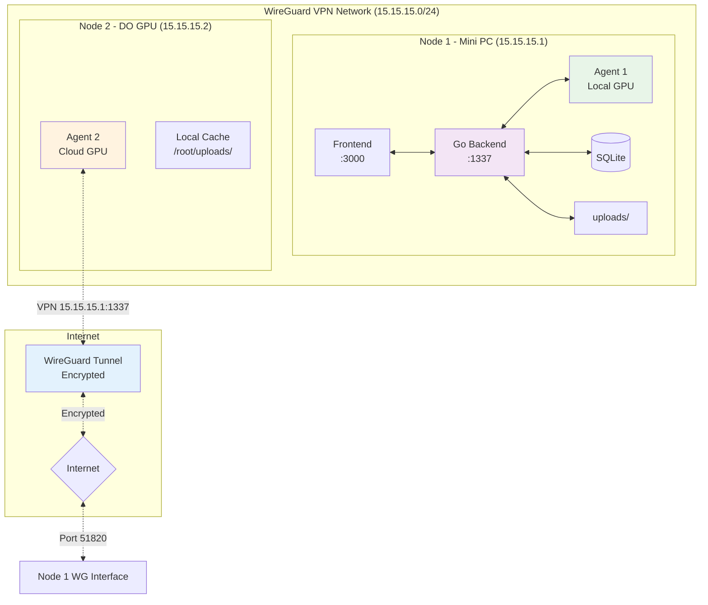

# WireGuard Deployment Guide

Panduan lengkap untuk setup distributed hashcat system menggunakan WireGuard VPN dengan 2 nodes:
- **Node 1**: Mini PC (Control Center + GPU Worker)
- **Node 2**: DigitalOcean GPU Server (Dedicated Worker)

## 🏗️ Architecture Overview



## 📋 Prerequisites

### **System Requirements**

#### **Node 1 (Mini PC)**
- **OS**: Ubuntu 22.04 LTS
- **CPU**: 8+ cores
- **RAM**: 32GB+ 
- **GPU**: RTX 3080/4080+ atau Tesla series
- **Storage**: 1TB+ SSD
- **Network**: Static local IP + Public IP access
- **Ports**: 51820/udp (WireGuard)

#### **Node 2 (DigitalOcean GPU)**
- **OS**: Ubuntu 22.04 LTS
- **CPU**: 4+ cores
- **RAM**: 16GB+
- **GPU**: Tesla T4/V100 atau RTX series
- **Storage**: 500GB SSD
- **Network**: Public IP provided by DO

### **Software Dependencies**
- Go 1.24+
- Node.js 20+
- WireGuard
- NVIDIA drivers
- Hashcat
- Git

## 🔧 WireGuard Setup

### **Step 1: Generate Keys**

**On both nodes, generate WireGuard keys:**

```bash
# Install WireGuard
sudo apt update
sudo apt install wireguard -y

# Generate keys
cd /etc/wireguard
sudo wg genkey | sudo tee privatekey | sudo wg pubkey | sudo tee publickey

# Show keys (save these for configuration)
echo "Private Key: $(sudo cat privatekey)"
echo "Public Key: $(sudo cat publickey)"
```

### **Step 2: Node 1 Configuration (VPN Server)**

**Create WireGuard server config:**

```bash
# /etc/wireguard/wg0.conf
sudo tee /etc/wireguard/wg0.conf << 'EOF'
[Interface]
PrivateKey = NODE1_PRIVATE_KEY_HERE
Address = 15.15.15.1/24
ListenPort = 51820
SaveConfig = true

# Enable IP forwarding
PostUp = echo 1 > /proc/sys/net/ipv4/ip_forward
PostUp = iptables -A FORWARD -i wg0 -j ACCEPT
PostUp = iptables -A FORWARD -o wg0 -j ACCEPT
PostUp = iptables -t nat -A POSTROUTING -o eth0 -j MASQUERADE

PostDown = iptables -D FORWARD -i wg0 -j ACCEPT
PostDown = iptables -D FORWARD -o wg0 -j ACCEPT
PostDown = iptables -t nat -D POSTROUTING -o eth0 -j MASQUERADE

# Node 2 peer configuration
[Peer]
PublicKey = NODE2_PUBLIC_KEY_HERE
AllowedIPs = 15.15.15.2/32
PersistentKeepalive = 25
EOF
```

**Configure firewall:**

```bash
# Allow WireGuard port
sudo ufw allow 51820/udp
sudo ufw allow ssh
sudo ufw enable

# Enable IP forwarding permanently
echo 'net.ipv4.ip_forward=1' | sudo tee -a /etc/sysctl.conf
sudo sysctl -p
```

**Start WireGuard service:**

```bash
sudo systemctl enable wg-quick@wg0
sudo systemctl start wg-quick@wg0
sudo systemctl status wg-quick@wg0
```

### **Step 3: Node 2 Configuration (VPN Client)**

**Create WireGuard client config:**

```bash
# /etc/wireguard/wg0.conf
sudo tee /etc/wireguard/wg0.conf << 'EOF'
[Interface]
PrivateKey = NODE2_PRIVATE_KEY_HERE
Address = 15.15.15.2/24
DNS = 8.8.8.8

[Peer]
PublicKey = NODE1_PUBLIC_KEY_HERE
Endpoint = NODE1_PUBLIC_IP:51820
AllowedIPs = 15.15.15.0/24
PersistentKeepalive = 25
EOF
```

**Configure firewall:**

```bash
# Minimal firewall (outbound VPN only)
sudo ufw allow ssh
sudo ufw allow out 51820/udp
sudo ufw enable
```

**Start WireGuard service:**

```bash
sudo systemctl enable wg-quick@wg0
sudo systemctl start wg-quick@wg0

# Test VPN connection
ping 15.15.15.1
```

## 🚀 Application Deployment

### **Node 1 (Control Center + Worker)**

#### **Install Dependencies**

```bash
# Install Go 1.24
wget https://go.dev/dl/go1.24.0.linux-amd64.tar.gz
sudo tar -C /usr/local -xzf go1.24.0.linux-amd64.tar.gz
echo 'export PATH=$PATH:/usr/local/go/bin' >> ~/.bashrc

# Install Node.js 20
curl -fsSL https://deb.nodesource.com/setup_20.x | sudo -E bash -
sudo apt install nodejs -y

# Install NVIDIA drivers and hashcat
sudo ubuntu-drivers autoinstall
sudo apt install hashcat git -y

source ~/.bashrc
```

#### **Deploy Application**

```bash
# Clone and build
git clone https://github.com/your-repo/go-distributed-hashcat.git
cd go-distributed-hashcat

# Build backend
make build

# Build frontend
cd frontend
npm install
npm run build

# Create directories
cd ..
mkdir -p data uploads/{wordlists,hash-files} shared-storage/{wordlists,hash-files}
```

#### **Configuration Files**

**Backend config (`config.yaml`):**

```yaml
server:
  host: "0.0.0.0"
  port: 1337
  debug: false

database:
  type: "sqlite"
  dsn: "./data/hashcat.db"

storage:
  path: "./uploads"

# VPN-specific settings
network:
  bind_interface: "wg0"
  trusted_subnets: ["15.15.15.0/24", "127.0.0.0/8"]

cors:
  allowed_origins: ["http://15.15.15.1:3000", "http://localhost:3000"]

security:
  enable_auth: false
  rate_limit: false
  max_file_size: "10GB"
```

**Startup script (`start-node1.sh`):**

```bash
#!/bin/bash
# start-node1.sh

set -e

echo "🔐 Checking WireGuard VPN..."
if ! sudo systemctl is-active --quiet wg-quick@wg0; then
    echo "Starting WireGuard..."
    sudo systemctl start wg-quick@wg0
fi

# Wait for VPN interface
until ip addr show wg0 >/dev/null 2>&1; do
    echo "Waiting for VPN interface..."
    sleep 2
done

echo "✅ VPN interface ready"

cd /home/user/go-distributed-hashcat

# Start backend server
echo "🚀 Starting backend server..."
./bin/server &
SERVER_PID=$!
echo "✅ Backend started (PID: $SERVER_PID)"

# Wait for server
sleep 3
until curl -s http://15.15.15.1:1337/api/v1/health >/dev/null; do
    echo "Waiting for backend..."
    sleep 2
done

# Start local agent
echo "🔧 Starting local agent..."
./bin/agent --server http://15.15.15.1:1337 \
           --name "node1-minipc-gpu" \
           --gpu-info "RTX-4080" \
           --max-jobs 2 &
AGENT1_PID=$!
echo "✅ Local agent started (PID: $AGENT1_PID)"

# Start frontend
echo "🌐 Starting frontend..."
cd frontend
npm run preview -- --host 15.15.15.1 --port 3000 &
FRONTEND_PID=$!
cd ..

echo "🎉 Node 1 fully operational!"
echo "📊 Dashboard: http://15.15.15.1:3000"
echo "🔌 API: http://15.15.15.1:1337/api/v1/"
echo "🔐 VPN Status:"
sudo wg show

# Save PIDs
echo "$SERVER_PID $AGENT1_PID $FRONTEND_PID" > /tmp/hashcat-pids
```

### **Node 2 (Dedicated Worker)**

#### **Install Dependencies**

```bash
# Install Go
wget https://go.dev/dl/go1.24.0.linux-amd64.tar.gz
sudo tar -C /usr/local -xzf go1.24.0.linux-amd64.tar.gz
echo 'export PATH=$PATH:/usr/local/go/bin' >> ~/.bashrc

# Install NVIDIA drivers and hashcat
sudo ubuntu-drivers autoinstall
sudo apt install hashcat git -y

source ~/.bashrc
sudo reboot
```

#### **Deploy Agent**

```bash
# Clone and build
git clone https://github.com/your-repo/go-distributed-hashcat.git
cd go-distributed-hashcat
go build -o bin/agent cmd/agent/main.go

# Create directories
mkdir -p /root/uploads/{wordlists,hash-files,temp}
```

#### **Systemd Service**

```bash
# /etc/systemd/system/hashcat-agent-vpn.service
sudo tee /etc/systemd/system/hashcat-agent-vpn.service << 'EOF'
[Unit]
Description=Hashcat Agent via WireGuard VPN
After=network.target wg-quick@wg0.service
Requires=wg-quick@wg0.service

[Service]
Type=simple
User=root
WorkingDirectory=/root/go-distributed-hashcat
ExecStartPre=/bin/bash -c 'until ping -c1 15.15.15.1; do sleep 2; done'
ExecStart=/root/go-distributed-hashcat/bin/agent \
    --server http://15.15.15.1:1337 \
    --name node2-do-gpu \
    --gpu-info Tesla-T4 \
    --max-jobs 4 \
    --heartbeat-interval 30s \
    --cache-size 5GB
Restart=always
RestartSec=10

Environment=HASHCAT_WORKLOAD_PROFILE=3
LimitNOFILE=65536

[Install]
WantedBy=multi-user.target
EOF

# Enable service
sudo systemctl daemon-reload
sudo systemctl enable hashcat-agent-vpn
```

## 📁 File Management

### **Shared Storage Setup**

**Node 1 file sharing script (`setup-file-sharing.sh`):**

```bash
#!/bin/bash
# setup-file-sharing.sh

# Create shared directories
mkdir -p /home/user/shared-storage/{wordlists,hash-files}

# Setup SSH keys for passwordless sync
if [ ! -f ~/.ssh/id_rsa ]; then
    ssh-keygen -t rsa -b 4096 -f ~/.ssh/id_rsa -N ""
fi

echo "📋 Copy this public key to Node 2 ~/.ssh/authorized_keys:"
cat ~/.ssh/id_rsa.pub

# Copy sample files
echo "📁 Setting up sample files..."
# Add your wordlists here
# cp /path/to/rockyou.txt /home/user/shared-storage/wordlists/
echo "✅ File sharing setup complete"
```

**Node 2 sync script (`sync-files.sh`):**

```bash
#!/bin/bash
# /root/sync-files.sh

REMOTE_SERVER="15.15.15.1"
LOCAL_DIR="/root/uploads"
REMOTE_DIR="/home/user/shared-storage"

echo "📁 Syncing files via VPN..."

# Sync wordlists
rsync -avz --update \
    user@${REMOTE_SERVER}:${REMOTE_DIR}/wordlists/ \
    ${LOCAL_DIR}/wordlists/ || echo "⚠️ Wordlist sync failed"

# Sync hash files
rsync -avz --update \
    user@${REMOTE_SERVER}:${REMOTE_DIR}/hash-files/ \
    ${LOCAL_DIR}/hash-files/ || echo "⚠️ Hash file sync failed"

echo "✅ File sync completed"
```

**Automated sync via cron:**

```bash
# Setup cron for file sync
crontab -e
# Add this line:
# */10 * * * * /root/sync-files.sh >/dev/null 2>&1
```

## 🚀 Deployment Procedure

### **Step 1: Deploy Node 1**

```bash
# SSH to Node 1
ssh user@NODE1_LOCAL_IP

# Setup WireGuard (completed in previous steps)
# Deploy application (completed in previous steps)

# Make startup script executable
chmod +x start-node1.sh

# Start Node 1
./start-node1.sh
```

### **Step 2: Deploy Node 2**

```bash
# SSH to Node 2
ssh root@NODE2_PUBLIC_IP

# Setup WireGuard (completed in previous steps)
# Deploy agent (completed in previous steps)

# Start services
sudo systemctl start wg-quick@wg0
sudo systemctl start hashcat-agent-vpn

# Verify connection
ping 15.15.15.1
sudo wg show
```

### **Step 3: Verification**

```bash
# From Node 1, check agents
curl http://15.15.15.1:1337/api/v1/agents/ | jq

# Expected output: 2 agents
# Access dashboard
open http://15.15.15.1:3000
```

## 🔧 Monitoring & Maintenance

### **Health Check Scripts**

**Node 1 health check (`health-check-node1.sh`):**

```bash
#!/bin/bash
# health-check-node1.sh

echo "🔍 Node 1 Health Check"
echo "====================="

# VPN Status
echo "🔐 VPN Status:"
sudo wg show

# Services Status
echo "🚀 Services:"
pgrep -f "bin/server" && echo "✅ Backend running" || echo "❌ Backend down"
pgrep -f "bin/agent" && echo "✅ Local agent running" || echo "❌ Local agent down"
pgrep -f "npm.*preview" && echo "✅ Frontend running" || echo "❌ Frontend down"

# API Health
echo "🔌 API Health:"
curl -s http://15.15.15.1:1337/api/v1/health && echo " ✅ API healthy" || echo " ❌ API unhealthy"

# Agent Count
echo "🤖 Registered Agents:"
curl -s http://15.15.15.1:1337/api/v1/agents/ | jq -r '.data | length'
```

**Node 2 health check:**

```bash
#!/bin/bash
# health-check-node2.sh

echo "🔍 Node 2 Health Check"
echo "====================="

# VPN Status
echo "🔐 VPN Status:"
sudo wg show

# VPN Connectivity
echo "🔗 VPN Connectivity:"
ping -c1 15.15.15.1 && echo "✅ VPN connected" || echo "❌ VPN disconnected"

# Service Status
echo "🚀 Service Status:"
systemctl is-active hashcat-agent-vpn && echo "✅ Agent service active" || echo "❌ Agent service inactive"

# GPU Status
echo "🎮 GPU Status:"
nvidia-smi --query-gpu=name,utilization.gpu,memory.used,memory.total --format=csv,noheader,nounits
```

### **Automated Monitoring**

**Setup monitoring cron:**

```bash
# Node 1 cron
# */5 * * * * /home/user/health-check-node1.sh >> /var/log/hashcat-health.log

# Node 2 cron  
# */5 * * * * /root/health-check-node2.sh >> /var/log/hashcat-health.log
```

## 🔐 Security Considerations

### **VPN Security Benefits**
- ✅ All traffic encrypted via WireGuard
- ✅ No public API exposure
- ✅ Network isolation
- ✅ Simplified firewall rules

### **Additional Security Measures**

```bash
# 1. Regular key rotation (monthly)
# 2. Monitor VPN logs
journalctl -u wg-quick@wg0 -f

# 3. Implement fail2ban for SSH
sudo apt install fail2ban

# 4. Regular security updates
sudo apt update && sudo apt upgrade -y
```

## 🐛 Troubleshooting

### **Common Issues**

#### **VPN Connection Problems**
```bash
# Check WireGuard status
sudo wg show

# Restart VPN
sudo systemctl restart wg-quick@wg0

# Check firewall
sudo ufw status
```

#### **Agent Registration Issues**
```bash
# Check agent logs
journalctl -u hashcat-agent-vpn -f

# Test connectivity
curl http://15.15.15.1:1337/api/v1/health

# Check DNS resolution
nslookup 15.15.15.1
```

#### **Performance Issues**
```bash
# Monitor GPU usage
nvidia-smi -l 1

# Check network latency
ping 15.15.15.1

# Monitor system resources
htop
```

### **Log Locations**
- **WireGuard**: `journalctl -u wg-quick@wg0`
- **Backend**: `./server.log`
- **Agents**: `journalctl -u hashcat-agent-vpn`
- **System**: `/var/log/syslog`

## 📈 Performance Optimization

### **Network Optimization**
```bash
# Optimize WireGuard MTU
# Add to [Interface] section:
# MTU = 1420

# Enable BBR congestion control
echo 'net.core.default_qdisc=fq' | sudo tee -a /etc/sysctl.conf
echo 'net.ipv4.tcp_congestion_control=bbr' | sudo tee -a /etc/sysctl.conf
sudo sysctl -p
```

### **GPU Optimization**
```bash
# Set GPU performance mode
sudo nvidia-smi -pm 1

# Set power limit (adjust as needed)
sudo nvidia-smi -pl 300

# Enable persistence mode
sudo nvidia-smi -pm 1
```

## 📊 Cost Optimization

### **DigitalOcean Cost Management**
```bash
# Start/stop DO droplet via API
# Save these scripts for cost optimization

# start-do-node.sh
curl -X POST \
  -H "Authorization: Bearer $DO_TOKEN" \
  "https://api.digitalocean.com/v2/droplets/$DROPLET_ID/actions" \
  -d '{"type":"power_on"}'

# stop-do-node.sh  
curl -X POST \
  -H "Authorization: Bearer $DO_TOKEN" \
  "https://api.digitalocean.com/v2/droplets/$DROPLET_ID/actions" \
  -d '{"type":"shutdown"}'
```

---

## 🎯 Quick Reference

### **Essential Commands**

```bash
# Start Node 1
./start-node1.sh

# Start Node 2
sudo systemctl start wg-quick@wg0
sudo systemctl start hashcat-agent-vpn

# Health Check
curl http://15.15.15.1:1337/api/v1/agents/

# Dashboard Access
open http://15.15.15.1:3000

# VPN Status
sudo wg show
```

### **Important IPs**
- **Node 1 VPN**: `15.15.15.1`
- **Node 2 VPN**: `15.15.15.2`
- **Dashboard**: `http://15.15.15.1:3000`
- **API**: `http://15.15.15.1:1337/api/v1/`

This setup provides a secure, high-performance distributed hashcat system with optimal cost efficiency! 🚀 
